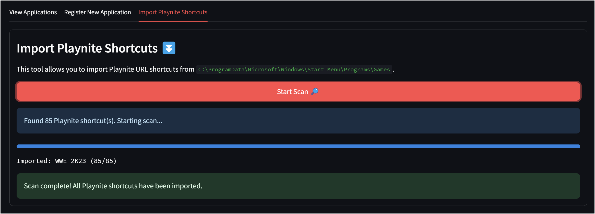

# Playnite Remote Launcher


A web interface for registering applications, viewing them in an organized card layout, and launching them with ease. Applications can be registered manually or imported from Playnite (`*.url`) shortcuts. Sit back and start games remotely!

## Features

- Remote Application Management : Register, view, and execute applications from any device on your network.
- Playnite Shortcut Imports : Automatically import Playnite shortcuts and posters for easy access and management.
- Persistent Storage : MongoDB serves as the backend database.

## Getting Started

### Prerequisites

- Python 3.x
- MongoDB
- [Playnite](https://playnite.link) installed on your system; The project expects `playnite://` to be a registered URL handlers.

### Setup Instructions

1. Clone the Repository:

    ```bash
    git clone https://github.com/bearlike/playnite-remote.git
    cd playnite-remote
    pip install -r requirements.txt
    ```

2. Configure `constants.py`

    ```bash
    streamlit run launcher.py
    ```

Access the application through your web browser, typically at `http://localhost:8501`.

### Usage Instructions

- Register New Applications : Use the "Register New Application" tab to fill out a form with details like title, subtitle, command, and working directory.

- View and Launch Applications : Navigate to the "View Applications" tab to see all registered applications displayed as cards. Click the "Run" button on any card to execute the associated command.

- Import Playnite Shortcuts : Go to the "Import Playnite Shortcuts" tab and click "Start Scan" to automatically import all Playnite shortcuts from the specified directory.



## Contributing

Contributions are encouraged! For issues, feature requests, or to contribute code, please [create an issue](https://github.com/bearlike/playnite-remote/issues/new).

## License

This project is licensed under the MIT License. See the [LICENSE](LICENSE) file for details.
